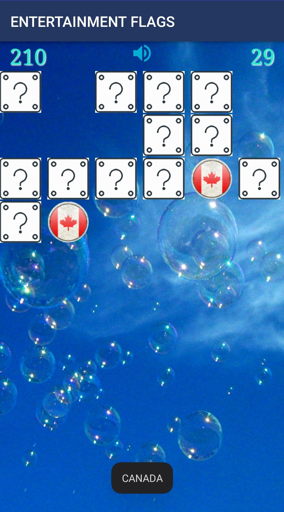

# entertainment-flags

<h3>Project description:</h3>
Entertainment Flags is a small app not only for killing your time but to improve your memory and 
skills to understand which flag refers to which country. There's two possible gameplay mode which 
do the process a little bit non-trivial. You can find many similar apps in play market but this one 
stands out from crowd by responsiveness during gameplay, and... so, there's no sense to talking too 
much about, it's just classical memory game and, to take the long story cut, just hurry up to load 
it and forget about your problems for some time. Enjoy. And don't forget to represent it to your 
little kid (if you have one...), he (she) will be fascinated. 

<h3>All features:</h3>
- The game has a total of 21 flag of countries around the world. Pick up all the paired flags and 
go through 6 levels, and open the extra game.
- progress can be saved and displayed in a way best result ever succeeded 

<h3>In this APP were used such tools like:</h3>
- Fragments 
- AudioManager 
- SharedPreferences 
- RecyclerView 

<h3>Instructions for assembling and running the application:</h3>
- The most popular and simple way - follow the link: 
https://play.google.com/store/apps/details?id=com.bignerdranch.android.memory and install app 
on your mobile phone. It's supported for android 4.4.2 (KitKat) and more high versions. 
- The way for those who are not looking for easy ways: To build the application, you need to 
install JDK, Git and, of coarse, Android Studio. As finish, not forget to install Google USB 
driver (Tools -> SDK Manager -> SDK Tools) and follow the folder SDK platforms to include Android 
SDK platform packages (from version 4.4 and higher). On folder VCS to chose Git and pull project. 
Connect your physical device and load APK file (Rebuild project + Run app). 

<h3>Some screenshots from the game:</h3>

